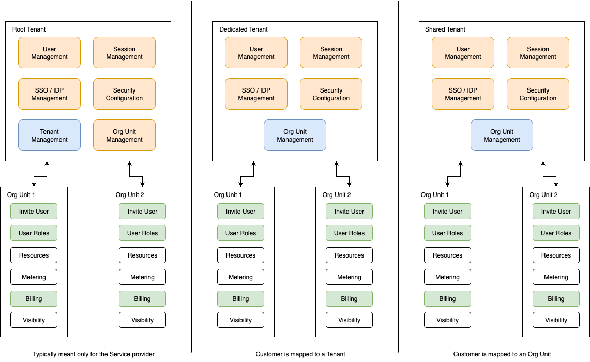

# Auth Gateway

This repo provides construct to manage Tenants with hard and soft tenancy
definitions to work with. Eventually this repo is also supposed to be offering
options to work as both Authentication and Authorization Gateway for all the
hosted services made available via the auth gateway

Following is the standard mapping of various types of multi tenancy
capabilities and resources supported in auth gateways

