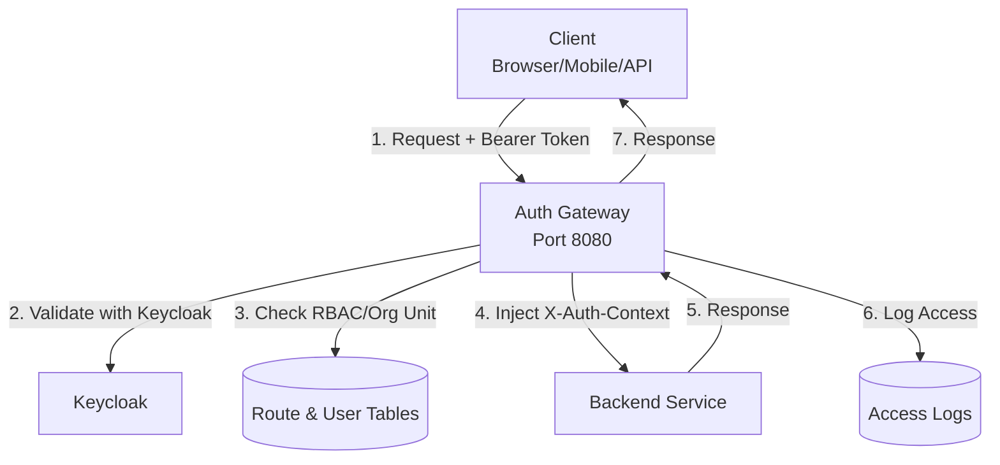
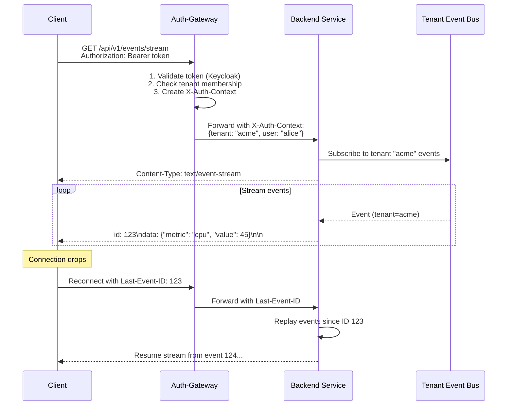
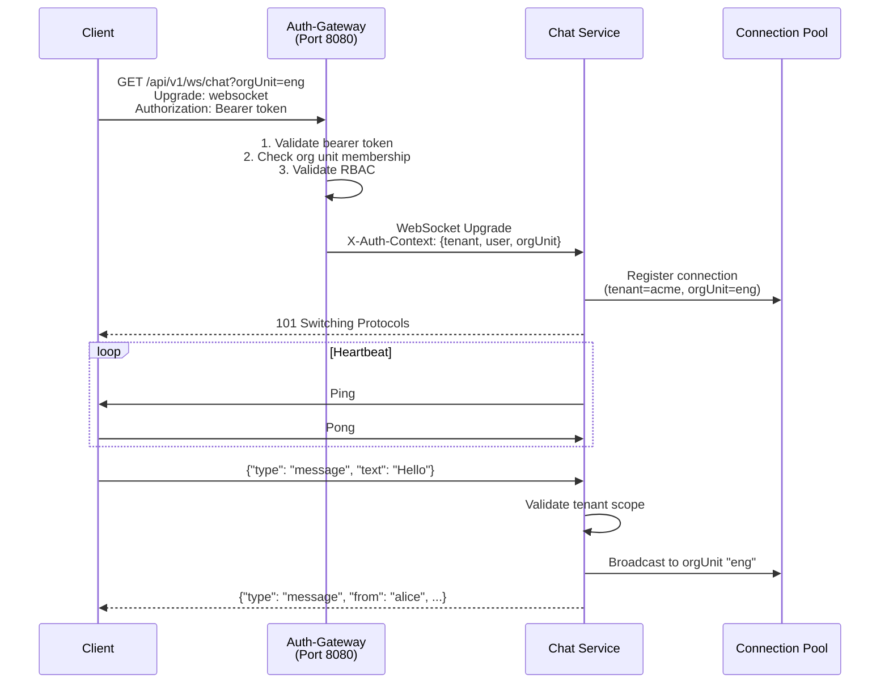
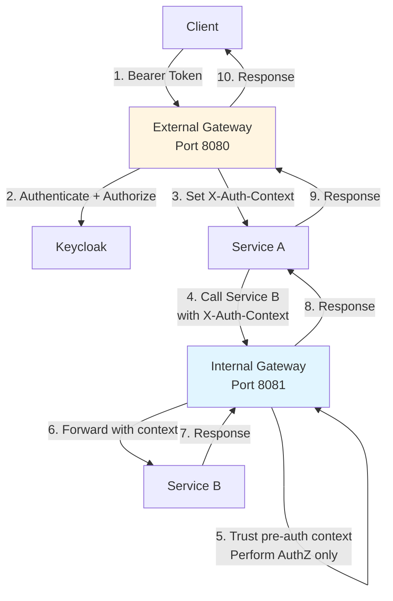
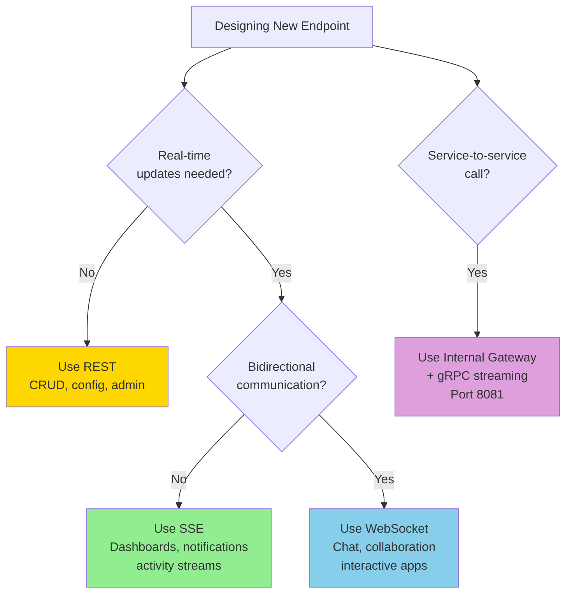

# REST vs Streaming: Building APIs Behind Auth-Gateway

When building services behind auth-gateway, choosing the right interaction model is critical for performance, user experience, and operational efficiency. Auth-gateway acts as your authentication and authorization layer, sitting between clients and your backend services. It handles multi-tenant authentication, RBAC/PBAC authorization, and request routing—but the interaction model (REST, SSE, WebSocket, or gRPC) determines how your service delivers data to users.

This guide helps you choose the right interaction model for your endpoints, understand how auth-gateway handles each protocol, and implement them correctly in multi-tenant environments.

## Why This Matters for Auth-Gateway Deployments

- **Multi-tenancy at scale**: Auth-gateway enforces tenant isolation and authorization for every request. Choosing the right interaction model affects how efficiently you can serve thousands of tenants with different resource profiles.
- **Real-time user expectations**: Modern SaaS applications require live updates—dashboards, notifications, collaborative features—without constant polling that wastes resources and increases latency.
- **Cost and resource efficiency**: Short-interval polling creates request storms that burn CPU, memory, and egress bandwidth. Streaming models deliver events only when they occur, reducing infrastructure costs while improving responsiveness.

---

## Understanding Interaction Models

Auth-gateway is protocol-agnostic and acts as a reverse proxy, forwarding authenticated and authorized requests to your backend services. It supports HTTP/1.1 and HTTP/2, which means your backend can implement any of these interaction models:

**REST (Request-Response):** Client sends HTTP requests; server responds with data. Simple, cacheable, stateless. Best for CRUD operations, admin interfaces, and low-frequency updates.
**Server-Sent Events (SSE):** Server pushes one-way messages to clients over HTTP. Built into browsers via `EventSource` API. Perfect for dashboards, notifications, live logs, and event streams where clients only consume data.
**WebSockets:** Full-duplex, bidirectional communication over a single TCP connection. Required for chat, collaborative editing, real-time gaming, trading platforms, and interactive agent loops where both client and server actively exchange messages.
**gRPC Streaming:** Binary, schema-first protocol with strong type contracts. Auth-gateway uses gRPC internally for its API services and exposes them via gRPC-gateway (REST). Your backend can use gRPC server streaming for efficient service-to-service communication.

### How Auth-Gateway Processes Each Model

1. **REST endpoints**: Auth-gateway authenticates via API keys or bearer tokens (Keycloak), performs RBAC/PBAC checks, injects `X-Auth-Context` header with user/tenant info, and proxies to your backend.

2. **SSE streams**: Auth-gateway validates the initial HTTP request, establishes authorization, then maintains the long-lived HTTP connection, forwarding events from your backend to clients. The `X-Auth-Context` header is set once at stream initiation.

3. **WebSocket connections**: Auth-gateway authenticates the upgrade request, validates tenant and org unit scope, then upgrades to WebSocket protocol. Your backend receives the authenticated WebSocket connection with user context.

4. **gRPC/gRPC-gateway**: Auth-gateway intercepts gRPC requests at the gateway layer (HTTP/2), performs authentication and authorization, and includes auth context in gRPC metadata for backend services.

---

## Common Pitfalls When Using Only REST Behind Auth-Gateway

- **Polling storms in multi-tenant environments**: Each tenant polling every 2-5 seconds multiplies load across all tenants. Auth-gateway processes every authentication and authorization check, creating bottlenecks at the gateway layer.
- **Stale dashboards and monitoring**: Users see outdated metrics because polling intervals miss rapid state changes. In multi-tenant systems, this creates inconsistent user experiences across tenants.
- **Inefficient use of auth-gateway resources**: Every poll triggers full authentication (API key validation or bearer token verification) and authorization (RBAC/PBAC checks, org unit validation). Streaming models authenticate once and maintain the connection.
- **Collaborative features break down**: Multiple users editing shared resources experience race conditions and overwrites because there's no real-time event distribution. Tenant-scoped updates don't propagate immediately.
- **Mobile and edge devices suffer**: Repeated authentication handshakes drain battery and increase network overhead, especially problematic for IoT devices or mobile clients in low-bandwidth scenarios.

---

## Use Cases: Which Model to Choose for Your Service

When building services behind auth-gateway, match your use case to the appropriate interaction model:

### Use REST When:
- **Tenant/user management**: Creating tenants, users, org units, assigning roles (CRUD operations)
- **Configuration and settings**: Updating service configurations, user preferences, org unit policies
- **Administrative actions**: Bulk operations, exports, reports, one-time operations
- **Low-frequency queries**: Fetching paginated lists, searching historical data
- **Public APIs**: Endpoints that need easy caching, broad client compatibility, and simple testing

**Examples in auth-gateway context**: Creating API keys, managing org unit memberships, configuring SSO providers, querying audit logs.

### Use SSE (Server-Sent Events) When:
- **Live dashboards**: Real-time metrics, KPIs, status indicators per tenant or org unit
- **Notifications and alerts**: Push notifications, system alerts, tenant-specific events
- **Activity streams**: Audit logs, user activity feeds, resource change streams
- **Build and deployment logs**: Streaming logs for CI/CD pipelines, job progress
- **Presence and status**: User online/offline status, collaborative presence indicators

**Examples in auth-gateway context**: Streaming authentication events per tenant, broadcasting org unit policy changes, real-time RBAC permission updates, tenant billing usage streams.

### Use WebSockets When:
- **Chat and messaging**: Real-time chat within tenants, support ticket conversations
- **Collaborative editing**: Multi-user document editing, shared whiteboards, design tools
- **Interactive applications**: Trading platforms, gaming, IoT device control panels
- **Agent and bot interactions**: AI agent loops, conversational interfaces, interactive workflows
- **Real-time command and control**: Device management, infrastructure orchestration

**Examples in auth-gateway context**: Multi-tenant chat with RBAC-controlled rooms, collaborative tenant dashboard editing, real-time policy enforcement and response, interactive security monitoring.

### Use gRPC Streaming When:
- **Service-to-service communication**: Microservices calling each other within your platform
- **Batch processing pipelines**: Data ingestion, ETL streams, event processing
- **Strong type contracts required**: Services that need schema validation and versioning
- **High-throughput scenarios**: When binary protocol efficiency matters

**Examples in auth-gateway context**: Internal gateway routing (port 8081) for service-to-service calls, streaming tenant events to analytics services, distributing RBAC policy updates to microservices.

---

## Why SSE is Ideal for Multi-Tenant SaaS Behind Auth-Gateway

Server-Sent Events (SSE) offer significant advantages for multi-tenant applications using auth-gateway:

### Authentication Efficiency
- **Authenticate once, stream continuously**: Auth-gateway validates credentials and tenant scope on initial connection, then maintains the authenticated stream. No repeated API key validation or bearer token checks.
- **Reduced auth-gateway load**: A single SSE connection replaces hundreds or thousands of polling requests, each requiring full authentication and authorization checks.

### Multi-Tenant Resource Optimization
- **Per-tenant connection limits**: Auth-gateway can enforce connection quotas per tenant or org unit, preventing noisy neighbors from exhausting resources.
- **Efficient tenant isolation**: Events are naturally isolated by connection; each authenticated stream only receives events for its authorized tenant/org unit scope.
- **Lower egress costs**: SSE sends only deltas (changed data) instead of full responses with HTTP headers on every poll.

### Developer Experience
- **Browser-native**: Built-in `EventSource` API works everywhere, no additional libraries required.
- **Automatic reconnection**: Browser handles reconnects with `Last-Event-ID`, allowing your backend to resume from the last delivered event.
- **Standard HTTP semantics**: SSE works through proxies, CDNs, and load balancers. Auth-gateway treats it as a long-lived HTTP connection.
- **Simpler than WebSockets**: For one-way data flow (server→client), SSE requires less code and fewer edge cases than WebSocket message framing and bidirectional state management.

### Observability and Security
- **Audit trail per connection**: Auth-gateway logs stream initiation with tenant, user, org unit, and IP address. Each event can be tracked to specific authenticated users.
- **RBAC enforcement at connection time**: Authorization is checked once at stream establishment. For dynamic permission changes, your backend can terminate streams and force re-authentication.
- **Request ID injection**: Auth-gateway adds `X-Request-Id` headers, enabling distributed tracing across the event stream lifecycle.

---

## Performance Comparison: Auth-Gateway Overhead Per Model

This matrix shows how each interaction model affects auth-gateway resource usage and system performance:

| Dimension | REST Polling (2s) | SSE | WebSocket |
|---|---|---|---|
| **Auth-gateway load** | High (auth per poll) | Low (auth once) | Low (auth once on upgrade) |
| **Tenant isolation overhead** | High (repeated RBAC checks) | Low (validated at connection) | Low (validated at connection) |
| **Latency to end user** | 1-2s (poll interval) | Sub-200ms (immediate push) | Sub-100ms (bidirectional) |
| **Network egress** | Very high (full HTTP headers + auth headers per poll) | Low (event deltas only, minimal framing) | Low (binary frames, minimal overhead) |
| **Connection scalability** | Unlimited requests; stateless | 10K-50K concurrent streams per gateway instance | 5K-20K concurrent connections per gateway instance |
| **Client battery impact** | High (repeated TLS + auth handshakes) | Low (single long-lived connection) | Medium (keepalive pings required) |
| **Resume/recovery** | N/A (stateless) | Native (`Last-Event-ID`) | Application-level (ACK/offset tracking) |
| **Auth-gateway complexity** | Simple (standard proxy) | Simple (long-lived HTTP) | Medium (WebSocket upgrade + framing) |
| **Tenant quota enforcement** | Rate limit by request count | Connection limit per tenant | Connection limit per tenant |
| **Org unit scope validation** | Every request | Once at connection | Once at connection |
| **Audit logging** | Per request | Per connection + per event | Per connection + per message |

### Key Takeaways:
- **REST polling** is simplest but least efficient—avoid for real-time use cases.
- **SSE** is the sweet spot for one-way updates: low auth-gateway overhead, browser-native, simple to implement.
- **WebSockets** are necessary only when bidirectional communication is required; added complexity must be justified.

---

## Implementation Patterns with Auth-Gateway

### Authentication Flow for Each Model

#### REST Endpoints
Every request goes through the full auth-gateway stack:
1. Client sends `Authorization: Bearer <token>` or API key via signature header
2. Auth-gateway validates credentials against Keycloak (bearer tokens) or API key store
3. Auth-gateway performs RBAC checks (tenant admin, org unit roles)
4. Auth-gateway injects `X-Auth-Context` header with user info (tenant, username, roles)
5. Backend receives authenticated request and can trust the injected headers
6. Response flows back through auth-gateway with access logging

#### SSE (Server-Sent Events) Streams
Authentication happens once; streaming is maintained:
1. Client initiates SSE connection: `GET /api/v1/events/stream?tenant=acme` with bearer token
2. Auth-gateway authenticates request and validates tenant scope
3. Auth-gateway maintains long-lived HTTP connection and sets `X-Auth-Context` header
4. Backend responds with `Content-Type: text/event-stream` and begins streaming
5. Backend publishes events with `id:` field for replay support
6. On disconnect, client reconnects with `Last-Event-ID` header; backend resumes from that point
7. Auth-gateway logs connection start/end with tenant, user, and duration

#### WebSocket Connections
Upgrade request is authenticated; connection is maintained:
1. Client initiates WebSocket upgrade: `GET /api/v1/ws/chat?room=general` with bearer token
2. Auth-gateway validates bearer token and org unit scope (if room is scoped to an org unit)
3. Auth-gateway upgrades connection to WebSocket protocol
4. Backend receives authenticated WebSocket with user context available in upgrade request headers
5. Backend implements heartbeat (ping/pong) to detect dead connections
6. Backend implements application-level message ACKs if delivery guarantees are needed
7. Auth-gateway logs WebSocket connection lifecycle (open, close, duration)

#### gRPC Streaming
For service-to-service communication, especially via internal gateway (port 8081):
1. Service A calls Service B through internal auth-gateway
2. Auth-gateway accepts `X-Auth-Context` from trusted external gateway (pre-authenticated)
3. Auth-gateway performs authorization checks (RBAC/PBAC)
4. Backend gRPC service receives streaming RPC with auth context in metadata
5. Stream remains open for bidirectional or server-streaming communication

### Tenant Isolation Considerations

**Tenant-scoped event streams**: Your backend must filter events by tenant. Auth-gateway provides tenant info in headers, but your application enforces data isolation.

**Org unit access control**: If streams are scoped to org units (e.g., `/api/v1/events/stream?orgUnit=engineering`), auth-gateway validates org unit membership at connection time. Your backend filters events accordingly.

**Quota and rate limiting**: Implement connection limits per tenant to prevent resource exhaustion. Monitor active connections per tenant and reject new connections when limits are reached.

### Delivery Guarantees

| Model | Delivery Guarantee | Implementation |
|---|---|---|
| REST | At-least-once (retry on failure) | Client retries failed requests |
| SSE | At-least-once with replay | Backend assigns monotonic `id:` to events; client sends `Last-Event-ID` on reconnect |
| WebSocket | Best-effort (unless app-level ACKs) | Backend assigns message IDs; client sends ACK; backend retransmits unacknowledged messages |
| gRPC Streaming | Depends on RPC type | Use gRPC stream context for backpressure and cancellation |

---

## Implementation Guide for Backend Services

### Building an SSE Endpoint Behind Auth-Gateway

**Backend implementation (Go example):**
```go
// SSE endpoint that streams tenant-scoped events
func HandleEventStream(w http.ResponseWriter, r *http.Request) {
    // Extract auth context injected by auth-gateway
    authCtx := auth.GetAuthContext(r) // reads X-Auth-Context header
    tenant := authCtx.Tenant
    username := authCtx.Username

    // Set SSE headers
    w.Header().Set("Content-Type", "text/event-stream")
    w.Header().Set("Cache-Control", "no-cache")
    w.Header().Set("Connection", "keep-alive")

    flusher, ok := w.(http.Flusher)
    if !ok {
        http.Error(w, "Streaming not supported", http.StatusInternalServerError)
        return
    }

    // Subscribe to tenant-specific event channel
    events := eventBus.Subscribe(tenant)
    defer eventBus.Unsubscribe(tenant, events)

    // Handle Last-Event-ID for replay support
    lastEventID := r.Header.Get("Last-Event-ID")
    if lastEventID != "" {
        replayEvents(w, flusher, tenant, lastEventID)
    }

    // Stream events to client
    for {
        select {
        case event := <-events:
            // Send event with ID for replay support
            fmt.Fprintf(w, "id: %s\n", event.ID)
            fmt.Fprintf(w, "data: %s\n\n", event.Data)
            flusher.Flush()

        case <-r.Context().Done():
            // Client disconnected
            log.Printf("SSE client disconnected: tenant=%s, user=%s", tenant, username)
            return
        }
    }
}
```

**Client implementation (JavaScript):**
```javascript
// Establish SSE connection with bearer token
const token = getBearerToken();
const eventSource = new EventSource('/api/v1/events/stream', {
    headers: {
        'Authorization': `Bearer ${token}`
    },
    withCredentials: true
});

// Handle incoming events
eventSource.onmessage = (event) => {
    const data = JSON.parse(event.data);
    updateDashboard(data);

    // Store last event ID for reconnection
    localStorage.setItem('lastEventId', event.lastEventId);
};

// Handle reconnection with Last-Event-ID
eventSource.onerror = () => {
    const lastId = localStorage.getItem('lastEventId');
    if (lastId) {
        // Browser automatically sends Last-Event-ID on reconnect
        console.log('Reconnecting from event:', lastId);
    }
};
```

### Building a WebSocket Endpoint Behind Auth-Gateway

**Backend implementation (Go with gorilla/websocket):**
```go
func HandleWebSocket(w http.ResponseWriter, r *http.Request) {
    // Extract auth context from auth-gateway
    authCtx := auth.GetAuthContext(r)
    tenant := authCtx.Tenant
    orgUnit := r.URL.Query().Get("orgUnit")

    // Validate org unit access (auth-gateway already checked membership)
    // Upgrade connection
    upgrader := websocket.Upgrader{
        CheckOrigin: func(r *http.Request) bool { return true },
    }
    conn, err := upgrader.Upgrade(w, r, nil)
    if err != nil {
        log.Printf("WebSocket upgrade failed: %v", err)
        return
    }
    defer conn.Close()

    // Register connection with tenant-scoped connection pool
    connID := connectionPool.Register(tenant, orgUnit, conn)
    defer connectionPool.Unregister(connID)

    // Enforce per-tenant connection limit
    if connectionPool.Count(tenant) > maxConnectionsPerTenant {
        conn.WriteMessage(websocket.CloseMessage,
            websocket.FormatCloseMessage(websocket.ClosePolicyViolation, "Connection limit exceeded"))
        return
    }

    // Heartbeat goroutine
    go func() {
        ticker := time.NewTicker(30 * time.Second)
        defer ticker.Stop()
        for range ticker.C {
            if err := conn.WriteMessage(websocket.PingMessage, nil); err != nil {
                return
            }
        }
    }()

    // Read messages from client
    for {
        _, message, err := conn.ReadMessage()
        if err != nil {
            log.Printf("WebSocket read error: %v", err)
            break
        }

        // Process message (with tenant context)
        handleMessage(tenant, orgUnit, message)
    }
}
```

**Client implementation (JavaScript):**
```javascript
const token = getBearerToken();
const ws = new WebSocket(`wss://api.example.com/api/v1/ws/chat?orgUnit=engineering`);

// Set bearer token (some WebSocket clients support this in headers)
// For browser WebSocket, include token in URL or use a connection endpoint
ws.onopen = () => {
    // Send authentication message if needed
    ws.send(JSON.stringify({ type: 'auth', token: token }));
};

ws.onmessage = (event) => {
    const message = JSON.parse(event.data);
    handleIncomingMessage(message);
};

ws.onerror = (error) => {
    console.error('WebSocket error:', error);
};

ws.onclose = () => {
    // Implement exponential backoff reconnection
    setTimeout(reconnectWebSocket, backoffDelay);
};

// Heartbeat response
ws.onping = () => {
    ws.pong();
};
```

### Registering Routes with Auth-Gateway

To expose your endpoints through auth-gateway, register routes in the route table. Auth-gateway dynamically loads routes and enforces authentication/authorization:

**Route registration (typically done at service startup):**
```go
import "github.com/go-core-stack/auth/route"

// Register SSE endpoint
route.Register(&route.Entry{
    Method:     "GET",
    Path:       "/api/v1/events/stream",
    Scheme:     "http",
    Host:       "your-backend-service:8080",
    IsPublic:   false, // Requires authentication
    IsRoot:     false, // Not restricted to root tenant
    TenantScoped: true, // Enforces tenant isolation
})

// Register WebSocket endpoint
route.Register(&route.Entry{
    Method:     "GET",
    Path:       "/api/v1/ws/chat",
    Scheme:     "http", // WebSocket upgrade starts as HTTP
    Host:       "your-backend-service:8080",
    IsPublic:   false,
    IsRoot:     false,
    OrgUnitScoped: true, // Validates org unit membership
})
```

---

## Common Pitfalls When Building Behind Auth-Gateway

### Authentication & Authorization
- **Not trusting X-Auth-Context header**: Auth-gateway injects authenticated user info in headers. Your backend should trust this header (it comes from authenticated source). Don't re-validate bearer tokens in backend services.
- **Bypassing auth-gateway**: Never expose backend services directly to the internet. All traffic must flow through auth-gateway for authentication and authorization enforcement.
- **Ignoring tenant context**: Always filter data by tenant ID from auth context. Auth-gateway validates user belongs to tenant, but your backend enforces data isolation.

### SSE-Specific Issues
- **Missing Last-Event-ID replay logic**: Without replay support, clients lose events during reconnections. Always assign monotonic IDs to events and implement replay from `Last-Event-ID` header.
- **Not handling client disconnects**: Use `r.Context().Done()` to detect when client disconnects and clean up resources (unsubscribe from event channels, close DB connections).
- **Forgetting flush after each event**: SSE requires explicit flushing of buffers to push events to client immediately. Without flushing, events buffer and latency increases.

### WebSocket-Specific Issues
- **No heartbeat mechanism**: Without ping/pong heartbeats, dead connections accumulate and waste resources. Implement 30-second heartbeat intervals.
- **Missing per-tenant connection limits**: Without connection quotas, a single tenant can exhaust all available connections. Track active connections per tenant and enforce limits.
- **Poor reconnection handling on client**: Implement exponential backoff when reconnecting to prevent connection storms during outages.

### Multi-Tenant Pitfalls
- **Cross-tenant data leakage**: Always validate that event streams, messages, and data queries are scoped to the authenticated tenant.
- **Ignoring org unit boundaries**: If your service uses org units for further isolation, validate org unit membership (auth-gateway validates at connection time, but data filtering is your responsibility).
- **No tenant-level resource monitoring**: Track connections, event throughput, and resource usage per tenant for debugging and capacity planning.

### Observability Gaps
- **Not logging connection lifecycle**: Log when SSE/WebSocket connections open and close with tenant, user, org unit, and duration. Essential for debugging and audit trails.
- **Missing request ID propagation**: Auth-gateway injects `X-Request-Id` headers. Include this in your logs to enable distributed tracing across services.
- **No per-tenant metrics**: Emit metrics (connection count, event rate, error rate) labeled by tenant for operational visibility.

---

## Decision Framework: Choose the Right Model

Use this decision tree when designing new endpoints for your service behind auth-gateway:

### Start Here
**Is this a real-time feature?**
- **No** → Use **REST** (standard CRUD, configuration, admin actions)
- **Yes** → Continue below

### For Real-Time Features
**Do clients need to send data back to the server during the session?**
- **No** (server→client only) → Use **SSE**
  - Examples: live dashboards, notifications, activity feeds, metrics streams
  - Benefits: Simple, browser-native, automatic reconnection, low auth-gateway overhead

- **Yes** (bidirectional) → Use **WebSocket**
  - Examples: chat, collaborative editing, gaming, IoT control, interactive agents
  - Considerations: Implement heartbeats, connection pooling, per-tenant limits

### For Service-to-Service Communication
**Are you calling other internal services through auth-gateway?**
- Use **Internal Gateway (port 8081)** with **gRPC streaming**
  - Benefits: Pre-authenticated requests, strong typing, efficient binary protocol
  - Auth-gateway accepts `X-Auth-Context` from external gateway and performs only authorization

### Additional Constraints

| Constraint | Recommended Model |
|---|---|
| Browser-only clients | SSE (built-in EventSource) |
| Mobile/native apps with battery concerns | SSE (lower overhead than polling) |
| Need event replay after disconnect | SSE (Last-Event-ID) or WebSocket with ACKs |
| High tenant isolation requirements | SSE or WebSocket (connection-level isolation) |
| Need strong type contracts | gRPC streaming (service-to-service) |
| 100K+ concurrent connections | SSE (more efficient than WebSockets) |
| Sub-50ms latency required | WebSocket (lowest latency bidirectional) |

### Quick Reference Table

| Feature | REST | SSE | WebSocket | gRPC Streaming |
|---|---|---|---|---|
| **Auth-gateway overhead** | High | Low | Low | Lowest (internal) |
| **Real-time updates** | No (polling) | Yes | Yes | Yes |
| **Bidirectional** | No | No | Yes | Yes |
| **Browser support** | Universal | Built-in | Built-in | Requires gRPC-Web |
| **Connection efficiency** | N/A (stateless) | High | Medium | High |
| **Tenant isolation** | Per request | Per connection | Per connection | Per stream |
| **Implementation complexity** | Low | Low | Medium | High |
| **Best for** | CRUD, config | Dashboards, notifications | Chat, collaboration | Service-to-service |

---

## Theory: Why Streaming Matters in Modern SaaS

### The Evolution of API Patterns
Traditional request-response patterns (REST) emerged when applications were simpler and users expected manual refreshes. Modern multi-tenant SaaS platforms demand:

1. **Real-time collaboration**: Multiple users working on shared resources need instant updates to avoid conflicts and data loss.

2. **Event-driven architectures**: Microservices publish events that trigger actions across the system. Polling doesn't capture this reactive model.

3. **Resource efficiency**: With hundreds or thousands of tenants, polling every tenant every few seconds creates multiplicative load that doesn't scale economically.

### Connection Models and Scalability

**HTTP/1.1 vs HTTP/2**: Auth-gateway supports both protocols. HTTP/2 enables:
- Multiple concurrent streams over a single TCP connection
- Header compression (HPACK) reduces overhead
- Binary framing improves efficiency
- Server push capabilities (though rarely needed for SSE/WebSocket)

**Long-lived connections**: SSE and WebSockets maintain open connections, which requires:
- Connection pooling and tracking per tenant
- Memory allocation for connection state
- Load balancer sticky sessions (or connection draining on rollouts)
- Graceful shutdown handling to avoid dropped connections

### Multi-Tenancy and Isolation

Auth-gateway enforces tenant boundaries at authentication time. Your backend service must:
- **Filter all data queries by tenant**: Never trust client-provided tenant IDs; always use tenant from auth context.
- **Isolate event streams**: Subscribe to tenant-specific channels or topics; never broadcast cross-tenant data.
- **Implement resource quotas**: Limit connections, message rate, and data volume per tenant to prevent abuse.

### Security Considerations

**Trust boundary**: Auth-gateway is your security perimeter. Once a request passes auth-gateway with `X-Auth-Context` set, your backend trusts that authentication succeeded. Never expose backend services directly to the internet.

**Token expiration**: For long-lived connections (SSE, WebSocket), bearer tokens may expire during the session. Options:
1. Force disconnection and re-authentication when token expires (simplest)
2. Implement token refresh via separate REST endpoint
3. Accept expired tokens for established connections but validate on reconnect

**Audit trail**: Auth-gateway logs all connections with tenant, user, IP, and user agent. Your backend should log significant events (messages sent, actions taken) with the same context for complete audit trails.

---

## Architecture Diagrams

### 1) Request Flow Through Auth-Gateway



### 2) SSE Flow for Multi-Tenant Dashboard



### 3) WebSocket Flow for Multi-User Chat



### 4) Internal Gateway for Service-to-Service Routing



### 5) Decision Tree: Choose Your Interaction Model



---

## Summary

When building services behind auth-gateway:

1. **Use REST** for traditional CRUD, configuration, and administrative operations. Auth-gateway handles authentication per request, making this simple and stateless.

2. **Use SSE** for real-time, one-way data streams (server→client). Perfect for dashboards, notifications, and activity feeds. Auth-gateway authenticates once, then maintains the connection with minimal overhead.

3. **Use WebSockets** only when bidirectional communication is required (client↔server). Necessary for chat, collaborative editing, and interactive applications. Requires heartbeat implementation and connection management.

4. **Use Internal Gateway with gRPC** for service-to-service communication. The internal gateway accepts pre-authenticated contexts and performs only authorization, enabling efficient microservice communication.

5. **Always enforce tenant isolation** in your backend. Auth-gateway validates tenant membership, but your service must filter data and events by tenant to prevent cross-tenant leakage.

6. **Monitor per-tenant resource usage**. Track connections, event rates, and resource consumption per tenant for operational visibility and fair resource allocation.

By choosing the right interaction model, you'll build efficient, scalable, and maintainable multi-tenant services that leverage auth-gateway's authentication and authorization capabilities.
